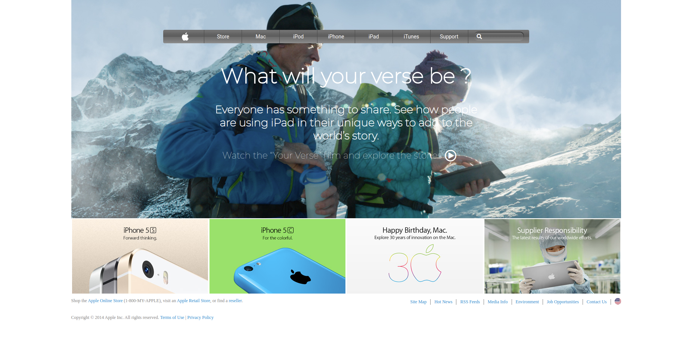

# Apple Clone website
This is my first solo project on Microverse, the fourth of the curriculum. It's a replica of the Apple store website (version 2014). It's a static page with some pictures, text and a navigation

# Contributor
Mouhamadou Diouf (<a href="https://github.com/MouhaDiouf">@mouhadiouf</a>)
# Live version
<a href="https://raw.githack.com/MouhaDiouf/apple_clone/master/index.html" target="_blank">Live version </a>